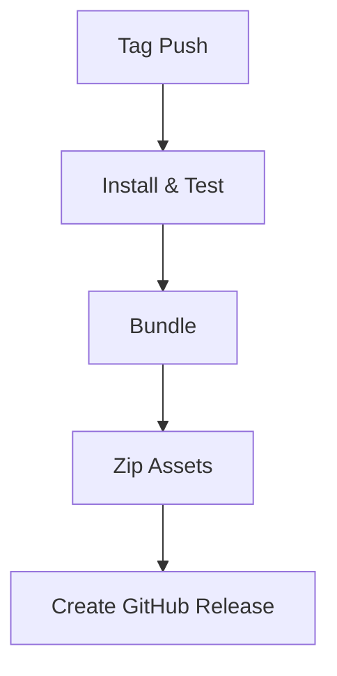

# GitHub Workflows

## release.yml
Builds and releases the plugin when a tag is pushed. It installs dependencies, runs tests, bundles the plugin with Rollup, zips the distribution, and attaches assets to a GitHub release.

