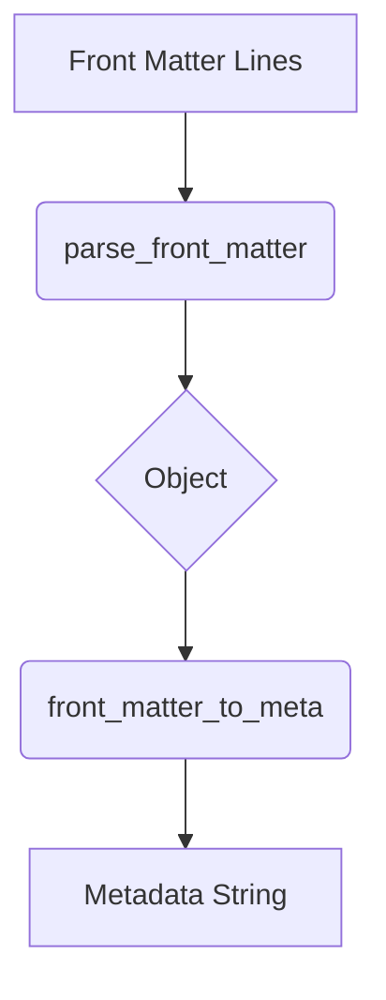

# Utility Functions

## parse_front_matter(lines)
Parses front matter lines into an object using `parseYaml` from the Obsidian API.
Returns an empty object when parsing fails.

## front_matter_to_meta(front_matter)
Converts a front matter object into a single-line metadata string using Dataview
style `key:: value` pairs.

## pick_front_matter(front_matter, keys)
Returns a front matter object with only the specified keys. Use `"*"` or an empty string to keep all keys.
